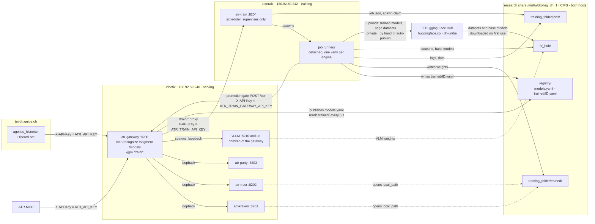
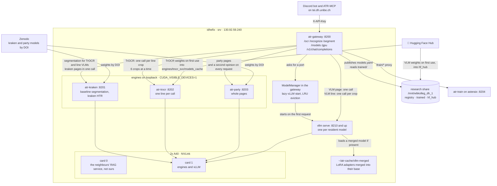
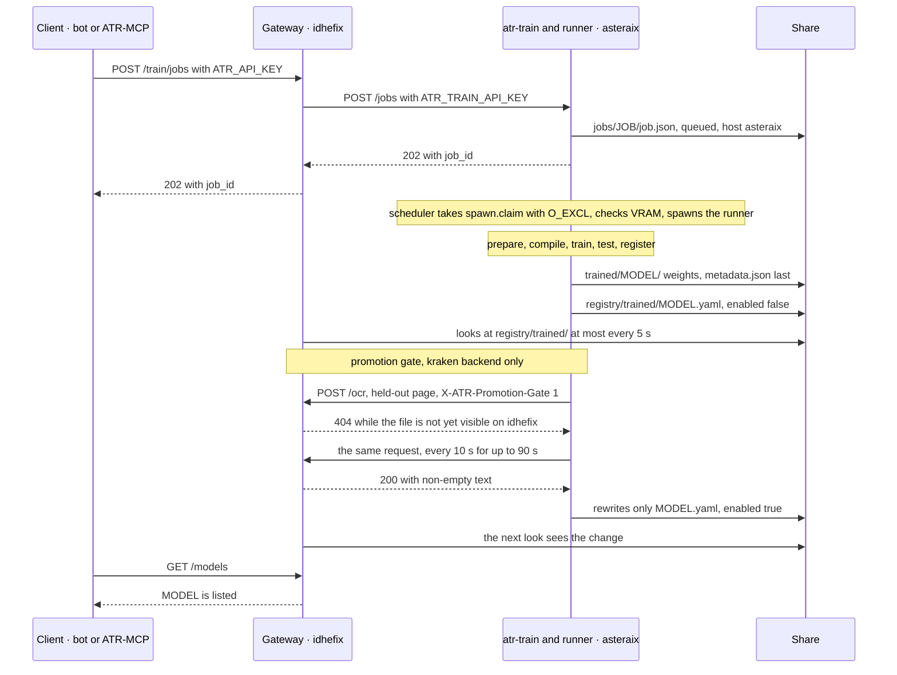

# Infrastructure: idhefix, asteraix and the research share

State of **16.09.2026**, measured on both machines unless a sentence says otherwise.

Since 16.09.2026 the ATR system runs on **two machines** with **two repositories** and
**one shared filesystem**:

- **idhefix** serves recognition from this repository.
- **asteraix** trains from
  [training-atr-models](https://github.com/thodel/training-atr-models).
- The **research share**, mounted on both, carries everything that passes from one to
  the other.

This file describes the whole system. The training machine is covered in more detail in
training-atr-models: [`docs/INFRASTRUCTURE.md`](https://github.com/thodel/training-atr-models/blob/main/docs/INFRASTRUCTURE.md) and its runbook
[`docs/OPERATIONS.md`](https://github.com/thodel/training-atr-models/blob/main/docs/OPERATIONS.md). The reasons
for the split are in [`SPLIT_PLAN.md`](SPLIT_PLAN.md).
The serving runbook is [`DEPLOY.md`](DEPLOY.md).

- [The system and interaction of servers](#the-system-and-interaction-of-servers)
- [idhefix at a glance](#idhefix-at-a-glance): the recognition path
- [Hosts](#hosts)
- [Services](#services)
- [Network and trust](#network-and-trust)
- [The research share](#the-research-share)
- [How a trained model reaches /models](#how-a-trained-model-reaches-models)
- [Shared values](#shared-values): the settings that must agree on both machines
- [Operations](#operations): deploy, restarts, logs, health, `.env`
- [UBELIX, the third place](#ubelix-the-third-place)
- [Decisions this setup rests on](#decisions-this-setup-rests-on)

## The system and interaction of servers



A trained model never travels over the network. Its weights and its registration are
**files on the share**. The only network calls between the machines are control calls
(`/train/*`) and the promotion gate, which checks that idhefix can serve the model.

**Hugging Face is the one outside place data comes from and goes to.** Datasets
(`dh-unibe/image-text_*`), base models and the VLM weights idhefix serves are
downloaded on first use into `hf_hub/` on the share: `~/.cache/huggingface/hub` is a
symlink to it on both machines, and no service sets `HF_HOME`, so whatever one machine
fetched, the other and UBELIX reuse. The TrOCR engine is the exception: it passes its
own `cache_dir` and keeps its weights in `engines/trocr_svc/models_cache` inside the
checkout on idhefix's local disk. Uploads are always private repositories under `dh-unibe`: trained models through
the trainer's auto-publish (off unless `ATR_TRAIN_AUTO_PUBLISH_MIN_ACCURACY` is set) or
by hand with `scripts/publish_to_hub.py`, and page datasets built from TEI editions with
`scripts/tei_edition_to_hf.py`. Both scripts still live in this repository and move to
training-atr-models with its #6. kraken and party models come from Zenodo by DOI
instead.

## idhefix at a glance



How a request is recognized depends on the model's engine and level:

| route | engine | what happens |
|---|---|---|
| `/segment` | kraken | baseline segmentation of a page |
| `/recognize`, `/ocr` | kraken | one call: the engine segments and transcribes the page |
| `/recognize`, `/ocr` | trocr | the gateway segments through kraken, crops the lines and sends them to TrOCR one per call, `line_concurrency` (6) at a time, then reassembles them top to bottom |
| `/recognize` | party | one call: the engine segments and transcribes the page |
| `/recognize` | vllm, page level | the ModelManager starts the model if it is not resident, the gateway scales the page to the pixel budget the model was trained at and makes one call |
| `/recognize` | vllm, line level | kraken segmentation, then one chat call per line crop |
| `/v1/chat/completions` | vllm | passed through to a resident model |

- **party runs beside every request** as a second opinion (`party_second_opinion`,
  on by default), except when party is the engine that was asked for. Its text comes
  back in `second_opinion`; a failed second opinion never fails the request.
- `/ocr` accepts only kraken and TrOCR; a VLM goes through `/recognize`.
- **Card 1 is the only card serving uses.** The engines held about 15.8 GB of it on
  16.09. and more since (#158), and the vLLM budget is what is left after them and a
  2048 MiB reserve (see [Two GPU views](#two-gpu-views)). Card 0 belongs to a
  neighbouring service.
- **Two vLLMs since 21.09. (#157):** `.venvs/vllm` (0.11) for every model, and
  `.venvs/vllm-next` (0.29.0+cu129) for the ones whose registry entry says
  `vllm_venv: vllm-next` — today only `qwen3.5-4b-german-xix-v2`. See
  `engines/vllm/README.md`.
- A trained model is opened from `local_path` on the share; a curated one from its
  Zenodo DOI (kraken, party) or its Hugging Face repository (TrOCR, vLLM).

## Hosts

| | idhefix — serving | asteraix — training |
|---|---|---|
| IP | 130.92.59.240 | 130.92.59.242 |
| `hostname` | `srv` | `dhserver03` (`dhserver03.wbkolleg.unibe.ch`) |
| SSH alias on the laptop | `idhefix`, and `srv-train` for the same box. `srv-train` is the `ProxyJump` of `ubelix`: do not rename it | `asteraix` |
| repository | `~/Repo/serving-atr-inference` | `~/Repo/training-atr-models` |
| role | gateway, recognition engines, vLLM | `atr-train` and the job runners it spawns |
| OS / kernel | Ubuntu 24.04.3 / 6.8.0-87 | Ubuntu 24.04.3 / 6.14.0-37 |
| CPU / RAM | Threadripper PRO 5965WX, 48 threads / 251 GB | the same |
| GPUs | 2× A40, 46068 MiB each, NVLink (NV4); driver 565.57.01 | 2× A40, 46068 MiB each, NVLink (NV4), P2P ok; driver 580.95.05 |
| GPU use | card 0: the neighbours' RAG service (`gunicorn.service`, 4 workers, ~10.4 GB), **not ours**. Card 1: our engines plus the gateway's vLLM children. 16.09.: engines 15.8 GB (party 8.9, trocr 3.8, kraken 3.1). 21.09. 08:05: **43.1 of 46.1 GB** — kraken 23.0 (11.0 of it from normal use since 17.09., #158; ~12 from one oversized smoke-test input), Qwen3.5 vLLM 12.4, party 6.1, trocr 1.6 | both cards free for training; jobs run on `ATR_TRAIN_GPU=1` until training-atr-models#12 |
| disk `/` | 1.8 T, 71 % used after the cleanup in #143 | 1.8 T, 74 % used |
| Python | 3.12.3 | 3.12.3 |
| sudo / linger | no passwordless sudo / linger on | no passwordless sudo / linger on |
| firewall | `ufw`. The gateway's code comments say `:8200` is opened to tei; not re-measured on 16.09. asteraix's promotion-gate requests do reach `:8200` (16.09.), so the rules admit that host too | `ufw` is active but **does not filter high ports**: a listener on `:8299` was reached from idhefix and from a VPN client (16.09.). Nobody has sudo to add a rule |
| listeners that are not ours | `:80` nginx, `:8080`, `:9000`, `:11434` Ollama, `127.0.0.1:8000`, docker bridge `:8006`–`:8009` | none besides `:22`, `:111` and `127.0.0.1:631` |

**Names.** For months, the docs and issues called the serving box "asterAIx". The
count in [`SPLIT_PLAN.md`](SPLIT_PLAN.md) (T0) found 176 such places across the
repositories. Fixing them is #136; until then, code comments and older docs in this
repository still say "asterAIx" where they mean idhefix. Until this change,
[`idhefix-environment.md`](idhefix-environment.md) was named `asteraix-environment.md`.
The name asteraix belongs to 130.92.59.242, the training box, and to nothing else.
Neither `hostname` (`srv`, `dhserver03`) serves as an identity: a job's owner is
whatever `ATR_TRAIN_HOST_ID` says.

**Nothing schedules on idhefix card 0.** The RAG service there belongs to someone else.
Every engine unit pins `CUDA_VISIBLE_DEVICES=1`, and the gateway launches vLLM on
`ATR_VLLM_GPU`, which defaults to 1. The host probe from June 2026, and the decisions
based on it, are in [`idhefix-environment.md`](idhefix-environment.md).

## Services

### idhefix: `~/Repo/serving-atr-inference`

All units are `systemctl --user` units from [`deploy/systemd/`](../deploy/systemd/),
installed by `scripts/install_user_units.sh`. Each one reads the checkout's `.env`.

| unit | port | bind | venv (torch) | GPU | restart, `KillMode` |
|---|---|---|---|---|---|
| `atr-gateway` | 8200 | `0.0.0.0` | `.venvs/gateway` (no ML dependencies) | none itself; its vLLM children use card 1 | `on-failure` after 3 s; default `KillMode` |
| `atr-kraken` | 8201 | `127.0.0.1` | `.venvs/kraken` (2.10.0+cu128) | `CUDA_VISIBLE_DEVICES=1` | `on-failure` after 5 s; default `KillMode` |
| `atr-trocr` | 8202 | `127.0.0.1` | `.venvs/trocr` (2.8.0+cu128) | `CUDA_VISIBLE_DEVICES=1` | `on-failure` after 5 s; default `KillMode` |
| `atr-party` | 8203 | `127.0.0.1` | `.venvs/party` (2.10.0+cu128) | `CUDA_VISIBLE_DEVICES=1` | `on-failure` after 5 s; default `KillMode` |
| vLLM, one process per resident model (not a unit) | 8210 and up (`ATR_VLLM_PORT_BASE`) | `127.0.0.1` | `.venvs/vllm` (2.8.0+cu128) | `ATR_VLLM_GPU`, default 1 | started and stopped by the gateway |

**vLLM is started by the gateway, not by systemd.** The gateway's `ModelManager` runs
`vllm serve` the first time a model is requested. The model is served under its
registry id on the next free port from 8210 and runs as a child of `atr-gateway`.
Merged LoRA models are served from `~/atr-cache/vllm-merged` (52 GiB). With the
default `KillMode`, stopping or restarting `atr-gateway` also ends those children,
so a gateway restart drops every resident model. The children write to the gateway's
journal.

**How much of card 1 vLLM may use** is computed each time a model is launched: the
card's total, minus the memory held by our own engines, minus `ATR_VLLM_VRAM_RESERVE_MB`
(2048). On 16.09.2026 that came to 28176 MiB. `ATR_VLLM_VRAM_BUDGET_MB` overrides the
calculation. When the card cannot be read, the budget falls back to 28190 MiB (the
21:50 measurement). The previous fixed value, 30000, promised memory the card no longer
has once the engines are loaded (#139).

**When a new model does not fit**, the gateway plans evictions before it terminates
anything. It picks the least recently used lazy models and counts each one at the
memory it actually holds. If evicting all of them would still not make room, nothing
is evicted and the request gets a `503`. In the old order (check first, evict by budget
only) every launch that needed an eviction failed. The sizing of a single launch is
described in [`DEPLOY.md`](DEPLOY.md#how-much-of-the-card-a-model-gets).

**Retired here: `atr-train`.** The old in-repo trainer (`127.0.0.1:8204`,
`.venvs/kraken-train`) was disabled on 16.09.2026. Its unit file was moved to
`~/atr-cache/retired-units/` and it was removed from `deploy/systemd/` and
`install_user_units.sh` (#139). It must stay off. It has none of training-atr-models#15's
job-ownership rules, so on the shared job store it would:

- mark asteraix's live runs failed, because their pids are not alive on idhefix
- start asteraix's queued jobs on idhefix's card
- delete registrations in progress under `trained/`

`install_user_units.sh` warns if the unit is still enabled or running. The old
training venvs (`kraken-train`, `trocr-train`, `vlm-train`) are still on the box, and
removing them is part of the idhefix cleanup (#143). The in-repo training code stays in
this repository until a follow-up of #143 removes it: gateway modules still import a few
names from it, and three scripts still read its settings.

### asteraix: `~/Repo/training-atr-models`

One unit, `deploy/systemd/atr-train.service`, installed by `scripts/install_user_unit.sh`.

| unit | port | bind | venv (torch) | GPU | restart, `KillMode` |
|---|---|---|---|---|---|
| `atr-train` | 8204 | `0.0.0.0` | `.venvs/kraken-train` runs the launcher `python -m atr_training.serve` | none for the service | `on-failure` after 5 s, `RestartPreventExitStatus=2`, **`KillMode=process`** |
| job runners (not units) | none | none | `.venvs/kraken-train`, `.venvs/trocr-train`, `.venvs/vlm-train` (all 2.8.0+cu128) | `ATR_TRAIN_GPU` (1) | detached children; they survive a restart of `atr-train` |

- **The service only supervises.** Each job runs as a detached child in its own
  engine's venv. There are three venvs because kraken 7.0.2 and a `transformers` recent
  enough for Qwen3-VL cannot share one dependency tree, and the service imports neither.
  `scripts/make_venvs.sh` builds them and `scripts/check_venvs.sh` checks them.
- **`KillMode=process` exists because of an incident.** The runner has its own session,
  but a session is not a cgroup. Under systemd's default, restarting the unit killed the
  run: on 07.08.2026 a deploy on idhefix ended a run 20 minutes into its compile, after
  2.5 h of prepare. With `KillMode=process`, a restart during v4's prepare on 15.09.2026
  left the run going.
- **The launcher refuses an open bind** (exit 2) unless three conditions hold:
  `ATR_TRAIN_REQUIRE_AUTH` is on, `ATR_TRAIN_API_KEY` has at least 32 characters, and
  `ATR_TRAIN_ALLOWED_CLIENTS` is not empty. `RestartPreventExitStatus=2` stops systemd
  from retrying a refused bind every 5 s, which would bury the message that says what
  is missing. `--check` gives the verdict without starting the service.

## Network and trust

| # | from → to | what for | authentication | what else protects it |
|---|---|---|---|---|
| 1 | tei.dh.unibe.ch (agentic_historian's Discord bot, `atr_status.py`) and the ATR-MCP (`mcp_atr/server.py`) → idhefix `:8200` | recognition, `/models`, `/gpu`, `/train/*` | `X-API-Key` = idhefix's `ATR_API_KEY` | `ufw` on `:8200` (per the code comments, not re-measured) |
| 2 | gateway → engines | `127.0.0.1:8201`–`8203`, vLLM `8210` and up | none | loopback bind |
| 3 | idhefix gateway → asteraix `:8204` | the `/train/*` proxy, including `/train/gpu` | `X-API-Key` = `ATR_TRAIN_API_KEY`, the same name and value on both hosts | the trainer's allowlist `ATR_TRAIN_ALLOWED_CLIENTS` = `130.92.59.240` (idhefix) |
| 4 | asteraix → idhefix `:8200/ocr` | the promotion gate: one held-out page | `X-API-Key` = `ATR_TRAIN_GATEWAY_API_KEY` (holds idhefix's `ATR_API_KEY`), plus `X-ATR-Promotion-Gate: 1` | the same as edge 1 |
| 5 | asteraix → idhefix `:8200/recognize` | evaluation, after training-atr-models#11 (planned) | as edge 4 | as edge 4 |
| 6 | both → the share | registry, weights, job records | filesystem (CIFS, group `research`) | the share's own access control |
| 7 | laptop → UBELIX `submit02.unibe.ch` | Slurm | the campus account's SSH key | `ssh ubelix` jumps through `srv-train`, which is idhefix (see [UBELIX](#ubelix-the-third-place)) |

**There are two keys, not one** (training-atr-models#9):

- `ATR_API_KEY` lets callers into the gateway.
- `ATR_TRAIN_API_KEY` lets the gateway into the trainer.

If one of them leaks, only one direction is open. The trainer refuses every route
except `/health` without its key. A refusal reaches the caller as a `502` that names the
gateway setting, never as a `401`, because the caller's own key was accepted.

**asteraix is protected by the application alone.** Its `ufw` does not filter high
ports, and nobody has sudo to add a rule. The trainer therefore checks both the key
and the source address on every request that does not come from loopback. A source
outside the allowlist gets a `403`, a wrong key a `401`. On 16.09. the test port was
also reached from a VPN client, so the network position of a caller protects nothing
here.

**Reaching the hosts from outside.** agentic_historian's `atr_status.py` records that
the gateway on idhefix is reachable only over the UniBE VPN, which is why its
connection errors name the URL. That is a note in code, not a measurement of 16.09.
asteraix was reached from a VPN client (16.09.), and its launcher assumes that a bind
beyond loopback is reachable from the whole university network
(`atr_training/serve.py`).

> TODO: measure whether idhefix's `:8200`, asteraix's `:8204` and SSH to both hosts
> answer from outside the university network without the VPN. Until then, assume
> that a laptop needs the VPN for both.

**The proxy's timeouts are shorter than the bot's.** The gateway waits 5 s to connect
and 20 s for an answer (`ATR_TRAIN_TIMEOUT_S`). On a timeout the caller gets a `504`
that names the trainer's URL. The bot gives up after 30 s. With 30 s on both sides,
the bot always gave up first and blamed idhefix.

**The promotion-gate header is narrow.** It makes the gateway serve a *disabled* trained
registration, but only to a request that carries it and a valid key, and only for a
registration that has no `disabled_reason` and is not a vLLM model. Every other caller
still gets a `404` for that model, and `GET /models` does not list it.

### Two GPU views

| route | whose cards | job attribution | read by |
|---|---|---|---|
| `GET /gpu` (gateway, key required) | **idhefix**: rows with `index`, `name`, `memory_*_mib`, `utilisation_pct`, `processes[]`, `unaccounted_mib`, `service_mib`, `orphaned_mib`, plus `host` and `vllm` (`gpu`, `service`, `pids`, `residents`, `budget_mb`, `budget`) | none: nothing trains here | nobody yet (agentic_historian#439 adds it) |
| `GET /train/gpu` (gateway → trainer `GET /gpu`) | **asteraix** | yes; only this host's live jobs count | the Discord bot's `/atr_gpu` and the MCP's `gateway_models` |

On idhefix, `unaccounted_mib` includes the neighbours' gunicorn workers on card 0.
Their rows carry `service: gunicorn.service`. That memory is unavailable to us, but it
is expected, not an alarm. Until 16.09.2026, the trainer and the gateway also
coordinated a shared card (`/gpu-claim`, `/admin/release-gpu`, `gpu_release.py`). That
coordination was removed in #139 because the two machines no longer share a card.

## The research share

`//resstore.unibe.ch/wbkolleg_dh_1` is mounted at **`/mnt/wbkolleg_dh_1` on both hosts**:
CIFS version 2.1, through autofs, `uid=0` with `forcegid`. The group `research` is
gid 1003 on idhefix and gid 1002 on asteraix. The mount works on both only because of
`forcegid`. On UBELIX the same share is `/storage/research/wbkolleg_dh_1`.

The share holds 12 T and is 90 % used (1.3 T free). It has been very stable: the outage
in August was planned maintenance.

### Who writes and who reads what

Paths are relative to `/mnt/wbkolleg_dh_1/Textrecognition_Training/`.

| path | written by | read by | notes |
|---|---|---|---|
| `registry/models.yaml` | the gateway (idhefix), at every start, from `config/models.yaml` in git | asteraix, for every engine: at every submit and again before every registration and every promotion gate, to refuse a `model_id` that is a curated id. kraken jobs also use it to resolve a `base_model` given as a registry id | disabled entries included; do not edit it on the share, the next gateway start overwrites it |
| `registry/trained/ID.yaml` | the trainer (asteraix), one file per model, tmp file + `os.replace`; file name = id. By hand: `python -m atr_training.registration` on asteraix ([below](#when-the-gate-did-not-promote-a-model)) | the gateway, at most every 5 s (`ATR_REGISTRY_RELOAD_INTERVAL_S`); `scripts/merge_loras.py` on idhefix, which lists disabled entries too | `enabled: true` entries are served without a restart; an id equal to a curated id is skipped |
| `training_folder/jobs/JOB/` | the trainer: `job.json`, `logs/`, `data/`, `spawn.claim` | the trainer, which acts only on its own jobs; the gateway reads none of it (logs and curves go over HTTP) | the single shared job store: 51 records on 16.09., of which 48 are legacy records from idhefix without `host` and 3 carry `host: asteraix` |
| `training_folder/trained/MODEL/` | the trainer's register stage: weights, then `metadata.json` last | on idhefix: the kraken engine and the trocr engine, which are handed the registration's absolute `local_path`; `scripts/merge_loras.py`, which takes a trained VLM adapter from there; `scripts/publish_to_hub.py` | 12 directories on 16.09. |
| `trained-ubelix/` | UBELIX training | — | weights trained on UBELIX |
| `hf_hub/` | both hosts and `lassberg/vlm_training`, through `~/.cache/huggingface/hub`, which is a symlink to it on both hosts | both hosts | 1.8 T; **never set `HF_HOME`**, it routes around the symlink |

The trainer removes a directory under `trained/` (at startup and after a `DELETE`)
only if all of the following hold:

- it has no `metadata.json`
- it has not changed for 24 h (`ATR_TRAIN_ORPHAN_WEIGHTS_MIN_AGE_H`)
- no live job of any host names it
- no registration names it

A registration writes `metadata.json` last, so until then another host's model in
progress looks exactly like an orphan.

### Where a model is registered

The gateway builds its registry from three sources. Only the second is on the share.

| source | where | written by | when the gateway notices a change |
|---|---|---|---|
| curated | `config/models.yaml`, in git on idhefix | a commit. A new vLLM entry also needs `scripts/download_models.py`, and a LoRA adapter `scripts/merge_loras.py` ([`DEPLOY.md` §4](DEPLOY.md#4-prefetch-model-weights-and-merge-vllm-lora-adapters)) | only at a restart of `atr-gateway`, which drops the resident vLLM models |
| trained | `registry/trained/ID.yaml` on the share | the trainer, or `python -m atr_training.registration` on asteraix | at the next look at the share, without a restart |
| legacy overlay | `config/models.local.yaml` on idhefix, gitignored | the retired in-repo trainer, until 16.09. | at the next look, like `trained/` |

**The legacy overlay is still read.** On 16.09. it held 11 registrations from the old
trainer, all `enabled: false`, and their weights are already on the share (#143).
#143 moves them to `registry/trained/` with the same writer; a follow-up named there
then stops the gateway from reading the file. Until then:

- An id in both the overlay and `trained/` is served from `trained/`, and the gateway
  logs the collision.
- An overlay id that is also a curated id stops the gateway from starting. On a
  reload, the same clash is logged and the previous registry stays in service.
- `scripts/merge_loras.py` reads all three sources, disabled entries included.

### CIFS rules, each one learned the hard way

| rule | why |
|---|---|
| no `chmod`, symlink or hardlink on the share | CIFS refuses them for a non-owner, and the share is `root:research` |
| copy with `shutil.copyfile`, never `copy2` | `register` died with `EPERM` after a run had trained and been evaluated: `copy2` also copies metadata |
| write a tmp file and `os.replace` it **in the same directory** | atomic on this mount: every `job.json`, `models.yaml` and registration is written this way |
| never rename across filesystems, so checkpoints and `TMPDIR` stay local | lightning's temp-file-plus-rename into the job directory failed ("Upgrade fsspec…"), and `ketos compile` died after 3 min with `ENOTEMPTY` from `rmtree` under a `TMPDIR` on the share |
| keep the datasets Arrow cache local | with it on the share, a prepare ran 11½ h and produced zero pages (`I/O operation on closed file`) |
| use `O_CREAT` with `O_EXCL` as the lock | measured to be exclusive across the two hosts; the spawn claim relies on it |
| expect a new file to appear on the other host seconds late | attribute caching: the gate's first request 8 s after a registration got a `404`, the second a `200`. The gate therefore retries every 10 s for up to 90 s |
| never build venvs with `TMPDIR` on the share | pip can install there but cannot *replace* a package: upgrades fail with `EPERM` and the venv silently keeps the old version (#48). `make_venvs.sh` switches to a local `TMPDIR` |

### What must not go on the share

| what | where instead | why |
|---|---|---|
| checkpoints | asteraix `~/atr-cache/checkpoints` | a temp-file rename would cross filesystems |
| `TMPDIR` | asteraix `~/atr-cache/tmp`, set in `.env` | `ENOTEMPTY` and pip failures; `dill` reads it at import time, so a shell profile is too late for a unit |
| the artefact cache (#109) | asteraix `~/atr-cache/artefacts` (38 GiB) | local by design. It does not follow the data: a new host starts cold. On 16.09. the warm key `82db328c96d7` let the v5 acceptance run skip prepare and compile in milliseconds, which otherwise take about 2 h |
| `.env` and its backups | each host's checkout and `~/atr-cache/env-backups/` (mode 600) | the share is readable by the whole `research` group, and CIFS cannot `chmod` a file to 600 |

## How a trained model reaches /models



1. A client submits through the gateway. The trainer validates the body, stamps the job
   with its own `host` and writes `job.json` with status `queued`.
2. The scheduler claims the job by creating `spawn.claim` with `O_EXCL`, checks that
   enough VRAM is free, and spawns the runner. A claim that nobody redeems within
   10 min fails the job and gives the reason.
3. The runner goes through the stages `prepare → compile → train → test → register`.
   `register` copies the weights to `trained/MODEL/`, writes `metadata.json` and then
   writes `registry/trained/MODEL.yaml` with `enabled: false`. A job whose registration
   cannot be written fails, and its error says where the weights are. Retraining an
   existing id first disables the old registration, then copies.
4. The gate posts one held-out page to idhefix's `/ocr`. It is non-empty text that
   flips the file to `enabled: true`, not merely a `200`: an empty `200` is how the
   gateway used to answer for a model it could not run. A failed gate does **not** fail
   the job. The model is registered, but it is not advertised.
5. The gateway serves the model at its next look at the share, without a restart.

Whether the gate runs depends on the engine:

| engine | gate | how the model reaches `/models` |
|---|---|---|
| `kraken` | runs it | automatically, once the gate passes; by hand if it failed ([below](#when-the-gate-did-not-promote-a-model)) |
| `trocr` | none (the backend keeps the default "no promotion gate") | by hand: it stays registered and disabled until someone enables it ([below](#when-the-gate-did-not-promote-a-model)) |
| `vllm` | never | by hand, after a merge: a LoRA adapter cannot be served by vLLM 0.11 until `scripts/merge_loras.py` on idhefix has merged it into its base ([below](#when-the-gate-did-not-promote-a-model)). The background is in [`VLM_TRAINING.md`](VLM_TRAINING.md#serving-what-you-trained), written before the split: where it says "overlay entry", read the registration `registry/trained/ID.yaml` |

A `model_id` equal to a curated id is refused at every step: by the API (`409`), by the
runner, by the gate, and by the gateway when it reads `trained/`. If two sets of weights
answered to one name, nobody could tell which one had transcribed a page.

### When the gate did not promote a model

A job can be `completed` while its model is missing from `/models`. The job record
says why:

```bash
curl -s -H "X-API-Key: $ATR_API_KEY" localhost:8200/train/jobs/JOB | python -m json.tool | grep -E '"(status|promoted|promotion_reason)"'
```

`promoted: false` with a `promotion_reason` is a normal outcome, not a failure. The
reason names the cause: a backend without a gate (trocr, vllm), a registration the
gateway never saw (check `ATR_REGISTRY_ROOT` against `ATR_TRAIN_REGISTRY_ROOT`), an
engine that returned no text, or a connection error, for example because the gateway
was restarting ([What survives what](#what-survives-what)). Nothing runs the gate
again, so a person decides what happens next:

1. **vllm only: merge first**, on idhefix, as in
   [`DEPLOY.md` §8](DEPLOY.md#8-training-is-not-on-this-box), which also says which
   venv to use: `scripts/merge_loras.py --only ID`.
2. **Try the model before anyone sees it** (kraken and trocr). A disabled trained
   registration without a `disabled_reason` answers the gate's own request:

   ```bash
   curl -s -H "X-API-Key: $ATR_API_KEY" -H "X-ATR-Promotion-Gate: 1" \
        -F image=@page.jpg -F model=ID localhost:8200/ocr
   ```

   A merged VLM cannot be tried this way, because the gateway never serves a disabled
   vLLM registration. Try it with `/recognize` right after step 3, and disable it
   again if it fails.
3. **Enable it**, on asteraix, with the trainer's own writer. It validates the file
   and replaces it with a tmp file and `os.replace`, as the
   [CIFS rules](#cifs-rules-each-one-learned-the-hard-way) require:

   ```bash
   cd ~/Repo/training-atr-models
   sed 's/^enabled: false$/enabled: true/' \
       /mnt/wbkolleg_dh_1/Textrecognition_Training/registry/trained/ID.yaml \
     | PYTHONPATH=src .venvs/kraken-train/bin/python -m atr_training.registration \
         --root /mnt/wbkolleg_dh_1/Textrecognition_Training/registry
   ```

   The gateway serves the model at its next look at the share. Disabling works the
   same way, with `true` and `false` swapped.

**Never edit `registry/trained/ID.yaml` in place with an editor.** While the editor
writes, the gateway can read a half-written file. training-atr-models has no
`promote` command yet, so this is the procedure until it has one. Its runbook covers
[registering by hand](https://github.com/thodel/training-atr-models/blob/main/docs/OPERATIONS.md#registering-by-hand) and
[promoting by hand](https://github.com/thodel/training-atr-models/blob/main/docs/OPERATIONS.md#promoting-by-hand).

### Who owns a job

training-atr-models#15 settles who owns a job:

- The service that accepts a job stamps it with its `host`.
- A record without `host` belongs to `ATR_TRAIN_LEGACY_JOB_HOST`, which defaults to
  `idhefix`.
- `ubelix` marks a job supervised by Slurm, which no trainer touches.

Reconcile, spawn, cancel, `DELETE` and `/gpu` act only on the host's own jobs. For a
foreign live job they answer `409` and name the host. A stuck foreign record is closed
without sending a signal:
`python -m atr_training.close_job JOB --reason … [--yes]`. The job statuses are
`queued`, `preparing`, `compiling`, `training`, `testing`, `registering`, `completed`,
`failed` and `cancelled`. The last three are terminal. Their state diagram is in
[the training machine's documentation](https://github.com/thodel/training-atr-models/blob/main/docs/INFRASTRUCTURE.md#the-life-of-a-job).

## Shared values

Since the split, the gateway and the trainer read **two `.env` files on two machines**.
These values must agree across them. This repository's `.env.example` marks its
side of each row with `>>> SHARED <<<`, and `tests/test_infrastructure_docs.py`
checks those markers against this table. training-atr-models' `.env.example` marks its
six values the same way and links each one here; its
[own table](https://github.com/thodel/training-atr-models/blob/main/docs/INFRASTRUCTURE.md#values-shared-with-idhefix) lists them from the
trainer's side.

In the last column, **loud** means the next `/train/*` call fails with an error that
names the setting. **Quiet** means only the promotion gate fails: the job still
completes with `promoted: false` and the reason in `promotion_reason`, and the model
stays disabled, which shows only at the end of a run. **Silent** means nothing fails
at the time. The trainer key, the trainer's URL and its allowlist are loud; the caller
key and the gateway's URL are quiet; the two paths are silent, which makes them the
most dangerous ones.

| idhefix `.env` (gateway, prefix `ATR_`) | asteraix `.env` (trainer, prefix `ATR_TRAIN_`) | value | if they disagree |
|---|---|---|---|
| `ATR_TRAIN_API_KEY` | `ATR_TRAIN_API_KEY` | the same secret, at least 32 characters | loud: every `/train/*` call is a `502` naming the setting |
| `ATR_API_KEY` | `ATR_TRAIN_GATEWAY_API_KEY` | the same secret, idhefix's caller key | quiet: the gate gets a `401`, which only `promotion_reason` records, and the model stays disabled |
| `ATR_REGISTRY_ROOT` | `ATR_TRAIN_REGISTRY_ROOT` | `/mnt/wbkolleg_dh_1/Textrecognition_Training/registry` | silent: models register into a directory the gateway never reads, and base models resolve against a file it never publishes |
| none; the gateway opens `local_path` exactly as written | `ATR_TRAIN_TRAINED_ROOT` | `/mnt/wbkolleg_dh_1/Textrecognition_Training/training_folder/trained`, absolute, the same path on both hosts, on the same filesystem as the registry | silent until a request: the gateway logs the missing path, and a request for the model fails naming it |
| `ATR_TRAIN_URL` | the unit's bind, `--host 0.0.0.0 --port 8204` | `http://130.92.59.242:8204` | loud: `/train/*` is a `502` naming the URL if the connection is refused, or a `504` ("could not connect within 5s") if nobody answers at that address |
| none (the gateway's own address) | `ATR_TRAIN_ALLOWED_CLIENTS` | `130.92.59.240` | loud: the trainer refuses the gateway, and the caller sees a `502` |
| the gateway's bind, `:8200` in its unit | `ATR_TRAIN_GATEWAY_URL` | `http://130.92.59.240:8200` | quiet: every job completes, but the gate cannot reach the gateway, and trained models stay disabled |

The trainer derives its curated file from its root (`<root>/models.yaml`). Do not also
set `ATR_TRAIN_MODELS_CONFIG`: two settings that name one place drift apart.

**If an address changes**, more than one place must follow:

- asteraix gets a new address: `ATR_TRAIN_URL` on idhefix, and the `ufw` rule on
  idhefix that admits asteraix to `:8200` for the promotion gate. That rule needs an
  admin ([`DEPLOY.md` §6](DEPLOY.md#6-who-may-reach-the-gateway)).
- idhefix gets a new address: `ATR_TRAIN_ALLOWED_CLIENTS` and `ATR_TRAIN_GATEWAY_URL`
  on asteraix, and every client's gateway URL (agentic_historian's
  `ATR_GATEWAY_URL`, or the legacy `KRAKEN_SERVICE_URL` it falls back to, and the
  ATR-MCP's).

Settings that exist **only on asteraix** but belong to this seam:

| setting | value | why |
|---|---|---|
| `ATR_TRAIN_HOST_ID` | `asteraix` | the job-ownership stamp; the hostname is no identity |
| `ATR_TRAIN_JOBS_ROOT` | `/mnt/wbkolleg_dh_1/Textrecognition_Training/training_folder/jobs` | the shared job store, used since 16.09. 22:47 |
| `ATR_TRAIN_GPU` | `1` | a physical index, as nvidia-smi counts |
| `TMPDIR` | `~/atr-cache/tmp` | local, see the CIFS rules |
| `HF_HOME` | **unset** | the symlink routes the cache to the share |

## Operations

### Deploy

**Serving on idhefix.** The full runbook is [`DEPLOY.md`](DEPLOY.md#9-deploying-an-update).

```bash
cd ~/Repo/serving-atr-inference
KEY=$(grep ^ATR_API_KEY= .env | cut -d= -f2)
ss -tn state established '( sport = :8200 )'     # any requests in flight? Wait for them.
curl -s -H "X-API-Key: $KEY" localhost:8200/train/jobs | python3 -c \
  'import json,sys; print([j["id"] for j in json.load(sys.stdin)["jobs"] if j["status"] == "registering"])'
                                                  # must print []; otherwise wait (see below)
git pull --ff-only
bash scripts/install_user_units.sh --no-start     # only if a unit file changed
systemctl --user restart atr-gateway              # drops resident vLLM models
systemctl --user restart atr-kraken               # or atr-trocr / atr-party, if their code or unit changed
```

**The unit files are copied before the restart**, because `install_user_units.sh` only
starts units that are stopped. Run after the restart, it would leave the running
services on the old unit.

**A job in `registering` may be in its promotion gate.** The gate retries only a `404`
for a model the gateway does not know yet. A connection refused by a restarting
gateway ends it at once: the model stays disabled, and nothing runs the gate again.
`ss` does not catch this, because the gate holds no connection during the 10 s between
two attempts. If a gate was lost anyway, the job's `promotion_reason` names the
connection error, and the model is enabled
[by hand](#when-the-gate-did-not-promote-a-model).

**Training on asteraix.** More detail is in training-atr-models.

```bash
cd ~/Repo/training-atr-models && git pull --ff-only
bash scripts/install_user_unit.sh --no-start      # asks the launcher before installing
systemctl --user restart atr-train                # running jobs survive
```

**Deploying while a job runs** needs one check first. A runner loads its stage scripts
(for example `python -m vlm_train_svc.evaluate_qlora`) and its function-level imports
from disk later in the run, so after a `git pull` it runs the new checkout's code.
Before deploying, diff those files against the commit the run started from. This was
checked for v5 on 16.09.

### What survives what

| event | survives | ends |
|---|---|---|
| restart of `atr-gateway` | the curated registry (read again from the checkout and published again), the trained registrations (read again from the share) and the legacy overlay `config/models.local.yaml` (read again; an overlay id that is also curated stops the start) | resident vLLM models (the next request reloads them, about 45 s for the 4B xix); requests in flight; a kraken job's promotion gate, if one is running: it fails without a retry, the model stays disabled, and the job's `promotion_reason` names the connection error ([what to do](#when-the-gate-did-not-promote-a-model)) |
| restart of `atr-train` | running jobs (`KillMode=process`) and every job record | nothing that is running; at startup the service reconciles its own jobs and cleans up orphaned weights under the conditions [above](#who-writes-and-who-reads-what) |
| reboot of either host | every enabled unit comes back (`WantedBy=default.target`, linger on) | everything that ran. The retired `atr-train` on idhefix stays down: it is disabled and its unit file has been moved away |
| the share goes away | the gateway keeps serving the registrations it has read. A gateway that starts during the outage serves the curated models after at most 10 s and publishes `models.yaml` once the share returns | requests for trained models whose weights cannot be opened; the stage logs, which live on the share (#134) |

### Logs

| what | where |
|---|---|
| gateway, including its vLLM children | `journalctl --user -u atr-gateway -f` on idhefix |
| engines | `journalctl --user -u atr-kraken` (or `atr-trocr`, `atr-party`) on idhefix |
| trainer | `journalctl --user -u atr-train -f` on asteraix |
| a job's stages | `training_folder/jobs/JOB/logs/` on the share (`runner.log`, `train.log`, …) |
| the same stage logs, through the API | `GET /train/jobs/{id}/log?stage=train&lines=N` |
| per-epoch curve | `GET /train/jobs/{id}/curve` |

### Health checks

```bash
# on idhefix
curl -s localhost:8200/health                                 # no key; engines and trainer, each with "reachable"
curl -s -H "X-API-Key: $ATR_API_KEY" localhost:8200/gpu       # this box's cards and the vLLM budget
curl -s -H "X-API-Key: $ATR_API_KEY" localhost:8200/train/gpu # asteraix's cards, through the proxy
systemctl --user status atr-train                              # must be disabled or not found
bash scripts/check_venvs.sh                                    # imports and versions per venv

# on asteraix
curl -s localhost:8204/health     # no key, but only from loopback or an allowlisted host
systemctl --user status atr-train
```

**`reachable` in `/health` means "answered below 500".** A trainer that refuses the
gateway with `401` or `403` still counts as reachable, while every `/train/*` call
fails with a `502`. The trainer checks its allowlist even before it serves its own
`/health`, so a gateway outside `ATR_TRAIN_ALLOWED_CLIENTS` sees a `403` there too.
`GET /train/jobs` is the check that uses the key and the allowlist.

### When `/train/*` fails

The bot passes the gateway's answer on as `URL answered STATUS: DETAIL`. The detail
says where to look:

| the caller sees | cause | first check |
|---|---|---|
| a connection error or timeout against `:8200` itself | the gateway on idhefix is down, or the caller is outside the VPN | on idhefix: `systemctl --user status atr-gateway`, `journalctl --user -u atr-gateway` |
| `401` from the gateway ("the gateway rejected the API key") | the client's key is not idhefix's `ATR_API_KEY` | the client's configuration |
| `502` "… refused the gateway with 401 …" | `ATR_TRAIN_API_KEY` differs between the hosts, or is empty on idhefix | in each host's checkout: `grep ^ATR_TRAIN_API_KEY= .env \| sha256sum`; the two hashes must match |
| `502` "… refused the gateway with 403 (client … is not in ATR_TRAIN_ALLOWED_CLIENTS) …" | asteraix's allowlist does not name the address idhefix calls from | `ATR_TRAIN_ALLOWED_CLIENTS` in asteraix's `.env`; the detail names the address the trainer saw |
| `502` "training service unreachable at …" | the connection was refused: `atr-train` is down, or `ATR_TRAIN_URL` names the wrong port | on asteraix: `systemctl --user status atr-train`, `journalctl --user -u atr-train`. Exit status 2 means the launcher refused the bind: `bash scripts/install_user_unit.sh --no-start` asks it again and prints what is missing |
| `504` "training service could not connect within 5s at …" | nobody answers at that address: asteraix is down, or `ATR_TRAIN_URL` names an old address | whether asteraix is up; `ATR_TRAIN_URL` on idhefix |
| `504` "training service did not answer within 20s at …" | the trainer accepted the connection and then hung | on asteraix: `journalctl --user -u atr-train` |
| `503` "training service at …: atr-train has no ATR_TRAIN_API_KEY configured …" or "… is not configured to serve remote callers …" | the trainer's own `.env` is incomplete; the detail lists what is missing | asteraix's `.env`, then `systemctl --user restart atr-train` |
| `502` "… answered 302 (redirect to …); ATR_TRAIN_URL must name the trainer itself" or "… with a non-JSON body …" | `ATR_TRAIN_URL` names some other HTTP service | `ATR_TRAIN_URL` on idhefix |

Every other error status from the trainer reaches the caller as it is (`400`, `404`,
`409`, `507` and so on). A `5xx` detail is prefixed with the trainer's URL, because it
describes asteraix, not idhefix.

### `.env`

- Before editing, back up the file to `~/atr-cache/env-backups/`. Keep every copy at
  mode 600.
- Never commit a copy. `.gitignore` ignores `.env` and `.env.*` and makes an exception
  only for `.env.example`. The reason is an incident on idhefix on 16.09.2026: a
  pre-deploy backup named `.env.bak-<date>` sat untracked and **not** ignored in this
  public repository, one `git add -A` away from publishing the key.
- `ATR_TRAIN_API_KEY` was generated on asteraix and piped to idhefix without being
  printed, and the hashes were compared afterwards. Do the same after a rotation.

## UBELIX, the third place

UBELIX is the university's Slurm cluster. It runs training jobs **without a service**:
no trainer supervises them.

- **Access.** From the laptop, `ssh ubelix` jumps through `srv-train`, which is idhefix,
  to `submit02.unibe.ch`. If idhefix is down, that route is down too. asteraix reaches
  `submit02:22` directly (measured), but it has no key yet (training-atr-models#17). The
  plan is a dedicated key there, restricted with `from="130.92.59.242"`.
- **Data.** The share is mounted at `/storage/research/wbkolleg_dh_1`. Job output goes to
  `/scratch/network/users/$USER`. Weights trained on UBELIX are kept in `trained-ubelix/`
  on the share.
- **Job records.** In training-atr-models, `ubelix/submit_job.py` and `fanout.py` stamp
  the records they write `host: ubelix`, and no trainer starts, judges or signals such a
  record. A record whose Slurm job has gone is closed with `close_job`. The older
  copies in this repository write no `host`, so their records count as idhefix's
  legacy records.
- **Free GPU capacity.**

  | QoS | GPUs | limit |
  |---|---|---|
  | `job_gpu_preemptable` | h100=4, a100=1, rtx4090=4, rtx3090=18 | 24 h; jobs can be killed |
  | `job_gratis` | h100=1, rtx4090=2 | 96 h |

  Only the accounts `gratis` and `teaching` are available; there is no PAYGO. Paying
  would give *fewer* H100s (h100=1).
- **Placement (planned, training-atr-models#17).** The trainer will choose per job, from
  measured UBELIX usage. A job that needs one H100 goes to `job_gratis`; a job that needs
  more goes to `job_gpu_preemptable`, but only if it can resume. asteraix registers the
  result once the Slurm job has ended.
- **Where the tooling lives.** The sbatch files, `submit.sh`, `status.sh` and the
  Apptainer definitions are still in this repository's [`ubelix/`](../ubelix/README.md).
  They move with training-atr-models#7. The background is in
  [`UBELIX_PLAN.md`](UBELIX_PLAN.md).

## Decisions this setup rests on

These were decided on 16.09.2026.

- **A running job is never migrated.** If it has less than about 6 h left, the cutover
  waits. Otherwise the job is cancelled with notice and resubmitted on the new machine.
  The decision is recorded in the cutover issue, with the job id and the remaining time.
- **One trainer per job store.** training-atr-models#15 enforces this in code. The old
  in-repo trainer on idhefix has none of that code, which is why it stays retired.
- **The handover is a file, not an HTTP call** (#138). There is no endpoint and no key
  for it, and no failure mode in which a job fails because the gateway was away when it
  finished.
- **No shared Python package** (`SPLIT_PLAN.md`, E3). The two repositories share a
  file format (the registration YAML) and HTTP contracts, but no code.
- **No GPU coordination between the machines** (#139). They share no card.

Further reading:

- [`idhefix-environment.md`](idhefix-environment.md): the June 2026 host probe and the
  decisions derived from it
- [`DEPLOY.md`](DEPLOY.md): provisioning and updating idhefix
- [`SPLIT_PLAN.md`](SPLIT_PLAN.md): why and how the split was made (in German)
- [`../IMPLEMENTATION_PLAN.md`](../IMPLEMENTATION_PLAN.md): the gateway's original design
- [training-atr-models](https://github.com/thodel/training-atr-models): the trainer
